# AWS Resiliency Skill for Claude

A Claude agent skill that acts as a senior AWS resiliency architect — reviewing infrastructure code, application code, and architecture designs for failure modes, blast radius, and recovery gaps.

Built for engineering teams building on AWS.



---

## What This Skill Does

When activated, this skill transforms Claude into an expert resiliency reviewer that:

- Reviews **IaC** (CDK, CloudFormation, Terraform) for infrastructure-level resiliency gaps
- Reviews **application code** (AWS SDK usage, retry logic, connection handling, circuit breakers) for behavioural resiliency issues
- Produces **structured findings** with severity ratings, blast radius analysis, and concrete fixes
- Frames issues in **business terms** (RTO, RPO, revenue impact) suitable for CTO/VP Engineering audiences
- Maps findings to the **AWS Well-Architected Reliability pillar**

---

## Who It's For

| Audience | How It Helps |
|---|---|
| **Cloud Architects** | Prepare rigorous architecture reviews, ORRs, and Well-Architected Reviews with opinionated, non-obvious findings |
| **Cloud Engineers** | Get senior peer-level IaC and SDK code review with specific line-level findings and corrected code snippets |
| **Site Reliability Engineers (SREs)** | Identify failure modes, blast radius, and recovery gaps before they become incidents |
| **Platform Engineers** | Validate infrastructure patterns for reliability, failover behaviour, and operational readiness |

---

## When Claude Will Use This Skill

This skill activates automatically when someone:

- Shares CDK, CloudFormation, Terraform, or application code and asks about resiliency, availability, fault tolerance, failover, DR, or reliability
- Asks _"is this architecture resilient?"_, _"what happens if this AZ goes down?"_, _"how do I make this highly available?"_, or _"what's my RTO/RPO here?"_
- Wants a Well-Architected Reliability pillar review of their stack or code
- Asks about specific AWS service failure modes — RDS failover behaviour, DynamoDB replication lag, Lambda cold starts, SQS visibility timeout edge cases, etc.
- Is preparing for an architecture review, ORR, game day, or Well-Architected Review
- Mentions: **HA, high availability, fault tolerance, disaster recovery, RTO, RPO, chaos engineering, game day, ORR, SLA, SLO, circuit breaker, retry storm, thundering herd, split-brain, failover**

---

## Coverage

| Domain | Services Covered |
|---|---|
| **Compute** | EC2, ECS, Lambda, Auto Scaling |
| **Data** | RDS, Aurora, DynamoDB, ElastiCache |
| **Networking** | VPC, Route53, CloudFront, ALB/NLB, Global Accelerator |
| **Storage** | S3, EBS, EFS |
| **Messaging** | SQS, SNS, EventBridge |
| **Observability** | CloudWatch, X-Ray, AWS Health Dashboard |
| **Multi-region & DR** | Backup & Restore, Pilot Light, Warm Standby, Active-Active |

---

## How It Works: Two-Layer Review Model

Most production incidents live in the gap between infrastructure configuration and application behaviour. This skill reviews both:

### Layer 1 — IaC Review (Infrastructure Resiliency)
What the infrastructure *is* — deployed topology, redundancy, failover configuration. Checks for single points of failure, missing Multi-AZ, absent health checks, wrong retention settings, missing backup config, and hardcoded capacity.

### Layer 2 — Application Code Review (Behavioural Resiliency)
How the application *behaves* under failure — SDK configuration, retry logic, connection handling, timeout values, circuit breakers, and idempotency. Checks for missing exponential backoff, hardcoded endpoints, connection pool exhaustion, missing DLQs, and synchronous chains that amplify failures.

> **Example:** A perfectly configured Multi-AZ RDS instance still causes a 10-minute outage if the application doesn't handle the 60-second DNS failover window correctly.

---

## Output Format

Findings are structured as:

```
🔴 CRITICAL | 🟡 HIGH | 🟠 MEDIUM | 🟢 LOW | ℹ️ INFO

[SEVERITY] [DOMAIN] — [SERVICE]
Failure mode: <what actually breaks and how>
Blast radius: <scope of impact — AZ, region, full service>
Finding: <specific issue in the code/config>
Code location: <file:line or resource name>
Fix: <concrete remediation with corrected code/config>
RTO/RPO impact: <how this affects recovery objectives>
Well-Architected ref: <REL pillar question>
```

Every review ends with:
1. **Blast radius summary** — what fails and in which scenarios
2. **RTO/RPO assessment** — estimated actual vs intended recovery objectives
3. **Top 3 priorities** — ranked by risk with effort estimates
4. **Well-Architected Reliability score** — RAG (Red/Amber/Green) per domain

---

## DR Pattern Reference

| Pattern | RTO | RPO | Cost | Use When |
|---|---|---|---|---|
| Backup & Restore | Hours | Hours | $ | Dev/test, non-critical |
| Pilot Light | 10–30 min | Minutes | $$ | Core services, moderate budget |
| Warm Standby | Minutes | Seconds | $$$ | Business-critical workloads |
| Active-Active | Near-zero | Near-zero | $$$$ | Mission-critical, revenue-generating |

---

## File Structure

```
aws-resiliency-skill/
├── SKILL.md                                  # Skill definition loaded by Claude
├── README.md                                 # This file
├── CONTRIBUTORS.md                           # Contributors
├── references/
│   ├── service-failure-modes.md             # Exact timeouts, quota limits, propagation windows per AWS service
│   ├── well-architected-reliability.md      # Full REL pillar question set with best practices
│   └── dr-patterns-and-runbooks.md          # DR pattern templates, game day exercises, ORR checklist
└── scripts/
    └── resiliency-review-template.md        # Structured output template for formal resiliency review deliverables
```

---

## Installation

1. Clone this repository:
   ```bash
   git clone https://github.com/nirmal84/aws-resiliency-skill.git
   ```

2. Add the skill to your Claude skills directory (typically `~/.claude/skills/`) or follow your Claude agent SDK configuration.

3. Claude will automatically load and apply the skill during relevant conversations.

---

## Author

**Nirmal Rajan** — [@nirmal84](https://github.com/nirmal84)
